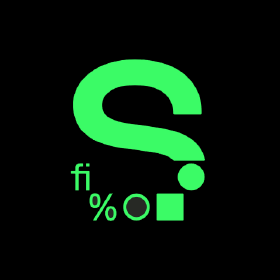

    

        
    

    

               
        

        

    
 

<b>Hi, I'm Nikunj!</b>

I love building [Computer Vision](https://www.sas.com/en_us/insights/analytics/computer-vision.html){:target="_blank"} applications and programming in Python. 
At the moment I'm doing my research on [Long-Short Term Networks](https://colah.github.io/posts/2015-08-Understanding-LSTMs/){:target="_blank"} and
developing a project on [American Sign Language Detection](https://github.com/nikunjlad/ASL-Detection-Using-Convolutional-Neural-Networks){:target="_blank"} using Parallel Computing strategies.

For more about me, please check out my [bio]({{ site.baseurl }}about/).

Curious to know where I have worked? Check out my [experience]({{ site.baseurl }}experience/).

For extra fun, take a look at some of the [projects]({{ site.baseurl }}projects/) I've worked on.

Get in touch with me by [email](mailto:{{ site.author.email }}) or follow me on [Github]({{ site.author.github }}).

To find all the information in one place, check out my [resume]({{ site.baseurl }}resume/).

Thanks for dropping by!
